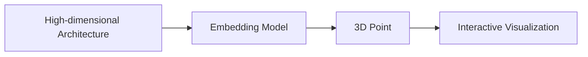

# The Sphere Metaphor

## Conceptual Overview

Imagine the space of all possible neural network architectures as points on a sphere. This geometric interpretation provides an intuitive way to understand and explore the vast landscape of architectural possibilities.

## Key Concepts

### Embedding Space

The 3D visualization you see in NeuroMosaic is actually a lower-dimensional projection of a much higher-dimensional space. We use advanced dimensionality reduction techniques to create this representation while preserving important relationships between architectures.



### Distance and Similarity

- **Proximity** = Architectural Similarity
- **Clusters** = Families of Related Architectures
- **Paths** = Smooth Transitions Between Designs

## Mathematical Foundation

The embedding process involves:

1. **Architecture Encoding**

   - Convert discrete architecture specifications into continuous vectors
   - Preserve topological relationships and design patterns

2. **Dimensionality Reduction**

   - Project high-dimensional embeddings to 3D space
   - Maintain relative distances and neighborhood relationships

3. **Metric Learning**
   - Adapt the embedding space based on performance data
   - Guide the search towards promising regions

## Visualization Components

Our interactive 3D scatter plot provides several layers of information:

<CodeGroup>
```python Point Colors
# Color mapping based on performance metrics
color = metrics.normalize(architecture_performance)
point.set_color(colormap(color))
```

```python Clustering
# Distance-based clustering
clusters = cluster_architectures(embeddings, method='dbscan')
visualize_clusters(clusters)
```

</CodeGroup>

## Navigation and Search

The sphere metaphor enables several powerful capabilities:

1. **Neighborhood Exploration**

   - Sample architectures near high-performing points
   - Smooth interpolation between successful designs

2. **Gradient-Based Search**

   - Follow performance gradients in the embedding space
   - Efficient optimization in continuous space

3. **Meta-Learning**
   - Learn from previous experiments
   - Adapt the embedding space to improve search efficiency

## Practical Applications

### Finding Similar Architectures

```python
def find_similar_architectures(reference_point, radius=0.1):
    """Find architectures within a radius of a reference point"""
    neighbors = spatial_query(
        point=reference_point,
        radius=radius,
        metric='euclidean'
    )
    return neighbors
```

### Interpolating Between Designs

```python
def interpolate_architectures(start_point, end_point, steps=10):
    """Generate intermediate architectures between two points"""
    path = linear_interpolation(
        start=start_point,
        end=end_point,
        num_steps=steps
    )
    return path
```

## Research Insights

The sphere metaphor has revealed several interesting properties:

1. **Topology Preservation**

   - Similar architectures naturally cluster together
   - Performance landscapes show meaningful structure

2. **Search Efficiency**

   - Continuous optimization is more efficient than discrete search
   - Meta-learning can adapt the space for better search

3. **Interpretability**
   - Visual patterns often correspond to architectural patterns
   - Helps in understanding architecture families and evolution

## Further Reading

- [Visualizing Results](/guides/visualize-results)
- [Meta-Learning Insights](/research/meta-learning-insights)
- [Running Experiments](/guides/run-experiments)
